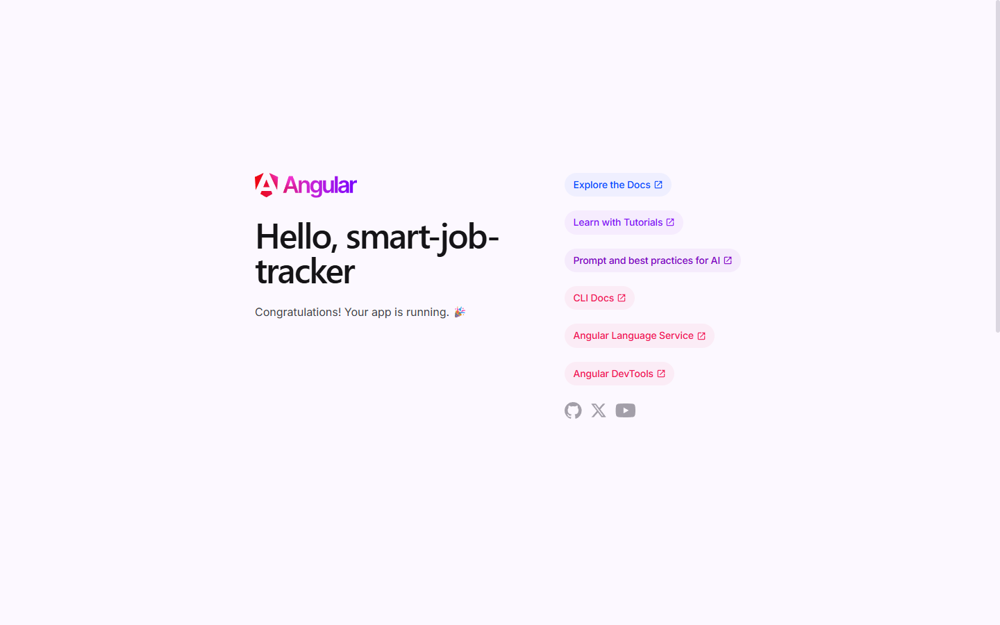
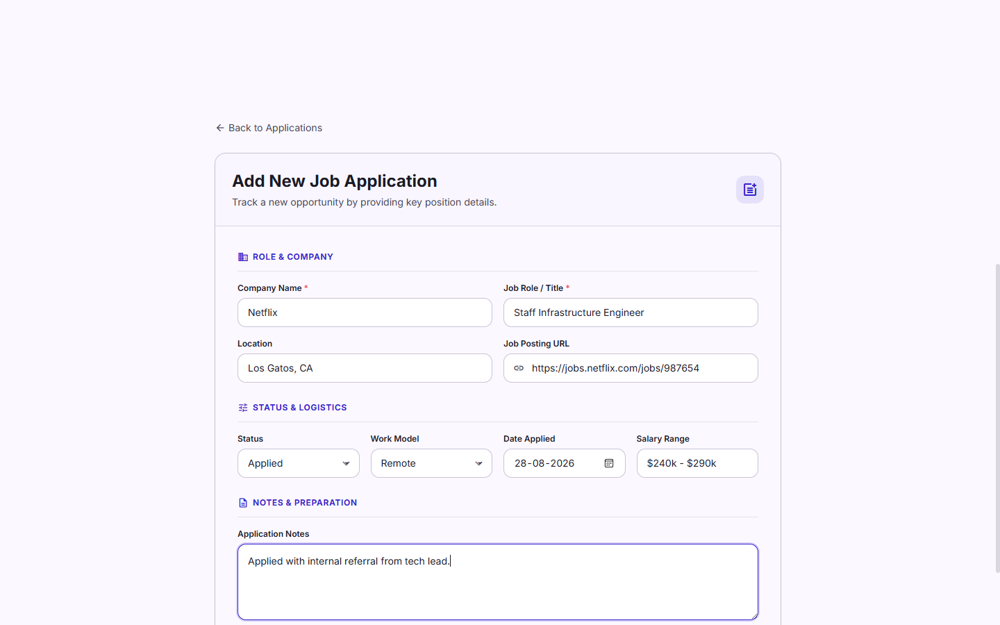
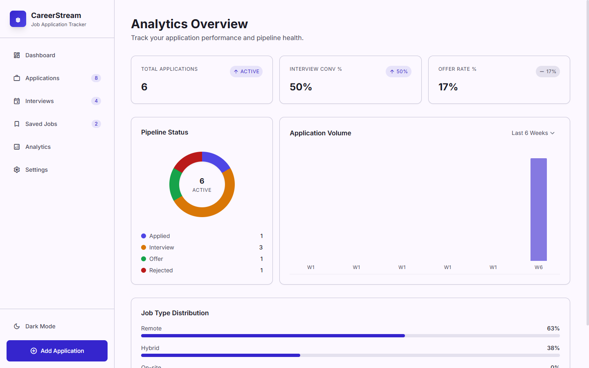

# CareerStream — Smart Job Application Tracker

[](https://angular.io)
[](https://www.typescriptlang.org)
[](https://sass-lang.com)
[]()

A modern, responsive Angular 20 SPA for tracking job applications, interviews, and career progress. It runs entirely in the browser with **localStorage** persistence and includes end-to-end Puppeteer tests that record a walkthrough video.

## Table of Contents

- [Demo](#demo)
- [Features](#features)
- [Tech Stack](#tech-stack)
- [Project Structure](#project-structure)
- [Getting Started](#getting-started)
  - [Prerequisites](#prerequisites)
  - [Quick Start (Windows)](#quick-start-windows)
  - [Manual Setup](#manual-setup)
  - [Build & Test](#build--test)
  - [E2E Tests](#e2e-tests)
- [Usage](#usage)
- [Data Models](#data-models)
- [Design System](#design-system)
- [Architecture Notes](#architecture-notes)
- [Notes](#notes)
- [License](#license)

## Demo

Click the thumbnail below to watch the full end-to-end walkthrough in GitHub's video player.

[](https://github.com/swetha-Git20/Smart-job-Application-Tracker/blob/main/e2e-run.mp4)

A few highlights from the walkthrough:

| Dashboard | Add Application | Analytics |
|---|---|---|
|  |  |  |

## Features

### Core Functionality
- **Application Management**: Create, edit, delete, and track job applications with full CRUD operations.
- **Interview Scheduling**: Schedule and manage interviews linked to specific applications.
- **Status Tracking**: Track application status (Applied, Interview, Offer, Rejected) with timeline history.
- **Search & Filtering**: Real-time search by company/role with status and job type filters.
- **Sorting**: Sort applications by date, company name, or recency.
- **Bookmarking**: Save interesting job opportunities for later review.
- **Analytics Dashboard**: Visual charts showing application pipeline health and performance metrics.
- **Data Export**: Export all data as JSON for backup.
- **Theme Switching**: Dark/light mode with persistent preferences.
- **Responsive Design**: Fully responsive for desktop (1440px+) and mobile (375px+).

### Pages
1. **Dashboard** - Overview with stat cards, recent applications, and upcoming interviews.
2. **Applications** - Full application list with search, filters, and management.
3. **Application Detail** - Detailed view with status timeline, notes, and linked interviews.
4. **Application Form** - Add/edit applications with validation.
5. **Interview Tracker** - Manage interviews with scheduling and filtering.
6. **Saved Jobs** - Bookmark and review saved opportunities.
7. **Analytics** - Visual analytics with charts and performance metrics.
8. **Settings** - Theme toggle, data export, and reset functionality.

## Tech Stack

- **Framework**: Angular 20 (Standalone Components)
- **Language**: TypeScript 5.9
- **Styling**: SCSS with the Kinetic Ledger design system
- **Routing**: Angular Router
- **Forms**: Reactive Forms with validation
- **State Management**: RxJS BehaviorSubject
- **Data Persistence**: localStorage
- **Icons & Fonts**: Material Symbols Outlined, Inter, JetBrains Mono
- **Build Tool**: Angular CLI 20
- **Testing**: Karma, Jasmine
- **E2E Recording**: Puppeteer, puppeteer-screen-recorder, ffmpeg

## Project Structure

```
src/
├── app/
│   ├── core/services/      # localStorage, CRUD, theme, toast services
│   ├── features/           # dashboard, applications, interviews, saved, analytics, settings
│   ├── shared/
│   │   ├── components/     # sidebar, mobile-nav, toast, confirm-dialog
│   │   └── models/         # application.model.ts
│   ├── app.component.ts
│   ├── app.routes.ts
│   └── app.config.ts
├── index.html
└── styles.scss

public/                   # Static assets (favicons)
e2e-screenshots/          # Screenshots captured by the E2E test
scripts/e2e-test.mjs      # Puppeteer E2E test & screen recorder
resume project design/    # Kinetic Ledger design files and specs
```

## Getting Started

### Prerequisites

- Node.js 18+
- npm 9+
- (Optional for E2E) Microsoft Edge or Google Chrome, and ffmpeg in `PATH` or configured in `scripts/e2e-test.mjs`

### Quick Start (Windows)

Run `start.bat` to install dependencies (if needed), start the dev server, and open the app in full-screen Edge or Chrome:

```batch
start.bat
```

### Manual Setup

1. Clone or extract the project.
2. Navigate to the project directory:
   ```bash
   cd Smart-job-Application-Tracker
   ```
3. Install dependencies:
   ```bash
   npm install
   ```
4. Start the dev server:
   ```bash
   npm start
   # or
   ng serve
   ```
5. Open http://localhost:4200.

### Build & Test

Production build:
```bash
ng build
```

The output is written to `dist/`.

Unit tests:
```bash
ng test
```

### E2E Tests

The E2E suite runs against `http://localhost:4200` with Puppeteer, captures 13 screenshots, and records the walkthrough to `e2e-run.mp4`.

1. Start the app in a separate terminal (`npm start`).
2. Update browser and ffmpeg paths in `scripts/e2e-test.mjs` if your system differs.
3. Run:
   ```bash
   node scripts/e2e-test.mjs
   ```

## Usage

### First Run
The app seeds sample data (Google, Stripe, Linear, etc.) on first load.

### Adding Applications
1. Go to the Applications page.
2. Click **Add Application** or the mobile FAB.
3. Fill in company, role, job link, location, job type, salary, and notes.
4. Submit the form to save.

### Managing Interviews
1. Open an application detail page.
2. Click **Schedule Interview**, enter the round, date/time, and mode.
3. The interview appears in the Interview Tracker and on the linked application.

### Searching & Filtering
- Use the search field on the Applications page for real-time company/role search.
- Filter by status and job type, and toggle between table and card grid views.

### Using Analytics
- View the Analytics page for a status donut, application volume bar chart, job type breakdown, and conversion rates.

### Theme & Data Management
- Toggle light/dark mode in Settings; the preference persists.
- Export all data as JSON, or reset the app to seed data from Settings.

## Data Models

### Application
```typescript
{
  id: string;
  company: string;
  role: string;
  jobLink: string;
  location: string;
  jobType: 'Remote' | 'Hybrid' | 'Onsite';
  status: 'Applied' | 'Interview' | 'Offer' | 'Rejected';
  appliedDate: Date | string;
  salaryRange?: string;
  notes?: string;
  statusHistory: { status: string; date: Date | string; notes?: string }[];
  isSaved: boolean;
}
```

### Interview
```typescript
{
  id: string;
  applicationId: string;
  roundName: string;
  dateTime: Date | string;
  mode: 'Online' | 'Onsite' | 'Phone';
  notes?: string;
}
```

## Design System

CareerStream uses the **Kinetic Ledger** design system:

- **Primary**: Indigo / Purple (#3525cd, #4f46e5)
- **Surface palette**: soft whites and off-whites in light mode, deep charcoals in dark mode
- **Typography**: Inter for UI, JetBrains Mono for data
- **Grid**: 8px linear grid, 12-column fluid layout on desktop, single-column on mobile
- **Shape language**: Soft-Modern with 8px radius, pill badges, 1px outlines, and subtle ambient shadows
- **Components**: Material Design-inspired cards, badges, inputs, and navigation
- **Responsive**: Sidebar on desktop, bottom navigation on mobile

## Architecture Notes

- **Client-side only**: All data is stored in `localStorage`. No backend, authentication, or external API calls.
- **Reactive state**: RxJS `BehaviorSubject` is used for lightweight state sharing across components.
- **Forms**: Angular Reactive Forms with required and URL validation.
- **Charts**: Built with pure CSS (no external chart libraries).
- **Icons**: Material Symbols Outlined from Google Fonts CDN.
- **Standalone components**: Every component is an Angular standalone component; no `NgModule`.

## Notes

- This is a portfolio/resume project for demonstration purposes.
- Not intended for production use.
- No authentication, real API calls, or external database.
- Tested end-to-end with Puppeteer on desktop and mobile viewports.

## License

This project is created for educational and portfolio demonstration purposes.